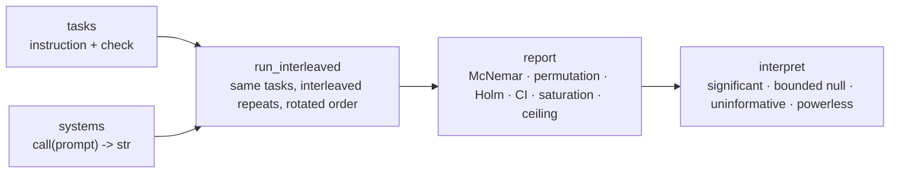

# paired-eval

Compare two LLM systems — different models, prompts, scaffolds, or agent strategies — and learn **which is better, how reliable that conclusion is, and whether you have enough samples**.

[中文](README.md) · [Docs index](docs/README.md) · [Changelog](CHANGELOG.md)

[](https://github.com/alloevil/paired-eval/actions/workflows/ci.yml)
[](pyproject.toml)
[](pyproject.toml)
[](LICENSE)

Pure standard-library Python ≥ 3.9, no third-party dependencies. Vendor-neutral: you inject the model as any `call(prompt) -> str`.

## Why

The three most common mistakes when comparing two LLM systems, and the mechanism that blocks each:

| Common practice | Problem | What this does instead |
|---|---|---|
Run each system once, compare averages | Single runs are noisy; a difference of two independent means is neither paired nor bounded | **Interleaved repeats on the same tasks**, paired per task, with effect size and bootstrap CI |
A t-test on two score columns | Scores aren't normal and there are usually only dozens of tasks | **Exact McNemar** (binary) and a **sign-flip permutation test** (continuous), Holm-corrected across comparisons |
"p > 0.05, so no difference" | "Not significant" means three very different things | **`interpret()` returns one of four verdicts**: significant / bounded null (what effect size is ruled out) / uninformative / powerless (no sample size would help — and what is missing) |




## Install

```sh
pip install git+https://github.com/alloevil/paired-eval.git
```

Or clone and `import` directly — there is nothing to build and nothing to install.

## Ten seconds, no API needed

```sh
python3 paired_eval.py --lang en        # or: pe.set_language("en") once, then every report is in English
```

Two stub systems run a paired A/B on 4 built-in format tasks (`bare` wraps correct JSON answers in markdown fences). Actual output:

```
informative sample: 2/4 tasks informative (always-pass 2, always-fail 0)
refusals: {'strict': 0, 'bare': 0}
at ceiling (1.000): strict — no headroom; effects measured against it as the reference are compressed
bare vs strict: Δ=-0.500 CI95=[-1.000,+0.000] | per-task p=0.506 per-round McNemar=0.00781 Holm=0.00781 | discordant 0:8 concentration=0.50 | significant: Δ=-0.500 CI95=[-1.000,+0.000] p=0.0078 (n=16)
```

Reading it: 2 of 4 tasks were solved by both systems every time and carry **no discriminating information** (informative sample 2/4); `strict` is at the ceiling, so effects measured against it are compressed; all 8 discordant pairs favour `strict` and they are spread over 2 tasks (concentration 0.50 — not a single-task artefact); the per-task permutation p is 0.506 because with only 2 informative tasks **its minimum attainable p is 0.5**, while per-round McNemar uses all 16 paired units and gives p = 0.0078. The last clause is `interpret()`'s verdict, ready to paste into a report.

## Your own systems and tasks

**1. Define tasks.** A task is a dict: an instruction, a programmatic checker, and one valid output (for self-checks). Checkers are deliberately strict — instruction following is what is being measured.

```python
import paired_eval as pe

tasks = [
    {"id": "date-iso", "instruction": "Write 5 March 2024 as an ISO 8601 date. Output only the date.",
     "check": lambda r: r.strip() == "2024-03-05", "canonical": "2024-03-05"},
    {"id": "json-pair", "instruction": 'Output the JSON object {"a": 1} and nothing else.',
     "check": lambda r: r.strip() == '{"a": 1}', "canonical": '{"a": 1}'},
]
```

**2. Plug in the models.** Any `call(prompt) -> str` works; `make_model` adds bounded retries and turns persistent failures into refusals that are dropped pairwise instead of crashing the batch. [`examples/adapter_openai_compat.py`](examples/adapter_openai_compat.py) is a standard-library-only adapter for OpenAI-compatible endpoints.

```python
systems = {"strict": pe.make_model(call_strict), "bare": pe.make_model(call_bare)}
```

**3. Run, then read the report.** `n` is repeats per task per system; interleaving rotates the order so time-window drift cannot leak into the comparison.

```python
run = pe.run_interleaved(systems, tasks=tasks, n=8, prompt_prefix="")
print(pe.report(run["reports"], refusals=run["refusals"])["text"])
```

Every field in the report guards against a specific mistake:

| Field | Meaning |
|---|---|
informative sample | Tasks both systems always pass or always fail carry no information; **read the MDE against the informative count** |
refusals | Dropped calls per system — the refusal rate is part of the result |
at ceiling / at floor | A system at 1.0 or 0.0 has no headroom; effects against it are compressed and interactions become uninterpretable |
Δ, CI95 | Effect size with a bootstrap 95% interval |
per-task p / per-round McNemar / Holm | The two paired tests; Holm correction when several systems are compared pairwise |
discordant a:b, concentration | Direction and spread of the disagreements; concentration 1.0 means all of it came from one task |
verdict | One of `interpret()`'s four verdicts; nulls carry "what effect this rules out" or "how many units are missing" |

## What else it does

**Score whether an agent's answer is faithful to the observations it saw** (claims are extracted one by one and grounded against the trajectory: grounded / distorted / fabricated):

```python
r = pe.evaluate({"id": "q1", "instruction": "Summarise the sources",
                 "verification": {"class": "trajectory", "grounding_policy": "must_ground"}},
                response=answer, observations=observations, llm=judge)
print(r["score"], r["metrics"]["fabricated"])      # grounding rate, number of unsupported claims
```

`judge(prompt, system, schema) -> dict` is a schema-constrained structured call. `evaluate` also routes `exact` (programmatic, no LLM), `retrieval` (verify against search results) and `rubric` (per-criterion binary judging with weights; `rubric_canary` checks that the rubric itself cannot be gamed by a bluffing answer).

**Plan the sample size before running** instead of hoping afterwards:

```python
pe.required_tasks(0.30, 0.10)         # A wins 30% / loses 10% of tasks: how many paired tasks for 80% power
pe.required_pairs(0.15, 0.30)         # continuous scores, mean diff 0.15, sd 0.30 -> runs the real permutation test to find n (~20 s)
pe.detectable_effect(31)              # the inverse: the smallest one-sided win rate 31 tasks can detect
pe.interpret(pe.paired_compare(scores_a, scores_b))["text"]   # afterwards: what this result can and cannot say
```

**Find tasks that actually discriminate**: `screen_tasks` / `screen_graded` screen in two stages (screen, then confirm) and by default exclude near-ceiling tasks (> 0.9 success) — they cannot be screened reliably at any affordable number of runs.

## How it relates to other tools

These are frameworks for *running* evaluations; paired-eval sits downstream of them and does not duplicate their task libraries or model backends. Descriptions are taken from each project's own README.

| Tool | What it does (per its README) | Relation |
|---|---|---|
[lm-evaluation-harness](https://github.com/EleutherAI/lm-evaluation-harness) | 60+ academic benchmarks over many model backends; per-metric standard errors (`bootstrap_stderr`) | Produces per-task scores → feed them to `paired_compare` / `interpret` to ask whether two systems' difference is credible and how many samples are missing |
[Inspect](https://github.com/UKGovernmentBEIS/inspect_ai) (UK AISI) | Eval framework with prompt engineering, tool use, multi-turn dialog and model-graded components; 200+ pre-built evals | Same: its scorer output is per-sample and pairs naturally |
[promptfoo](https://github.com/promptfoo/promptfoo) | Side-by-side model/prompt comparison with assertions; red teaming | Overlaps on "compare"; paired-eval adds the statistical verdict layer (power, floors, rule-out bounds) |
[openai/evals](https://github.com/openai/evals) | Registry of template-based (basic / model-graded) evals fed by JSON data | Same downstream relation |

## API overview

`import paired_eval as pe` exposes everything (the implementation lives in a few modules whose names are historical):

| Group | Entry points |
|---|---|
Paired A/B | `make_model` `run_interleaved` `run_paired` `run_repeated` `report` `pairwise_compare` `reliability_matrix` `saturation` |
Tasks and scoring | `evaluate` `evaluate_pair` `evaluate_batch` `validate_task` · built-in `ALL_TASKS` (31 Chinese smoke tasks, for examples and self-tests) |
Verifiers | `grade_answer` (numeric / choice / set / `\boxed{}`) `extract_claims` `verify_trajectory` `run_rubric` `rubric_canary` |
Statistics | `paired_compare` `mcnemar_exact` `holm_adjust` `wilson_ci` `pass_hat_k` `required_tasks` `required_pairs` `detectable_effect` `p_floor` `min_units_for_alpha` `interpret` |
Screening | `screen_tasks` `screen_graded` |
Adapters | `make_resilient` (bounded retry) `throttled_pmap` (bounded concurrency) `Meter` (cost metering) |
Language | `set_language("en"\|"zh")` — report text language; every `report` / `interpret` also takes `lang=` |

Every function's docstring states which mistake it guards against; the methodology is in [docs/lessons.md](docs/lessons.md).

## Scope and status

- **Is**: a statistics toolkit for comparing two (or more) systems, plus a composable stack of verifiers (exact match → programmatic check → retrieval → judge / rubric).
- **Is not**: a large task library (the 31 built-in tasks are examples and self-tests, in Chinese), an evaluation platform or dashboard, or a model-provider client. Use a dedicated eval framework to run large task suites; feed its **per-task scores** into `paired_compare` / `interpret` — this project answers "is that difference credible, and how many more samples would it take?".
- **Status**: 0.1.0, single author, API may change. Report text is available in English (`set_language("en")`) and Chinese; code comments, exceptions and the built-in tasks are Chinese.
- [docs/findings.md](docs/findings.md) is one case study done with this toolbox (one model pair, three task families). Its numbers are instance-specific and show how a conclusion should be written, not results to cite.

## Docs · Contributing · License

[docs/README.md](docs/README.md) indexes the documentation: methodology lessons, the case study, and overturned conclusions.
Read [CONTRIBUTING.md](CONTRIBUTING.md) before changing code (hooks, the mutation-testing baseline, extra discipline for statistical code). MIT.
