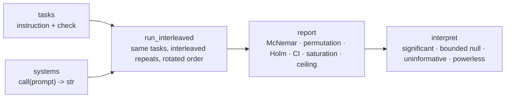

# paired-eval

Compare two LLM systems — different models, prompts, scaffolds, or agent strategies — and learn **which is better, how reliable that conclusion is, and whether you have enough samples.**

[中文](README.md) · [Docs](docs/README.md) · [Changelog](CHANGELOG.md)

[](https://github.com/alloevil/paired-eval/actions/workflows/ci.yml)
[](pyproject.toml)
[](pyproject.toml)
[](LICENSE)

Pure standard-library Python ≥ 3.9, no dependencies. You inject the model as any `call(prompt) -> str`; no vendor binding.

## Install

```sh
pip install git+https://github.com/alloevil/paired-eval.git
```

## Ten seconds

```sh
python3 paired_eval.py --lang en        # or pe.set_language("en") once in code
```

Two stub systems run a paired A/B on 4 built-in format tasks (`bare` wraps correct JSON answers in markdown fences):

```
informative sample: 2/4 tasks informative (always-pass 2, always-fail 0)
refusals: {'strict': 0, 'bare': 0}
at ceiling (1.000): strict — no headroom; effects measured against it as the reference are compressed
bare vs strict: Δ=-0.500 CI95=[-1.000,+0.000] | per-task p=0.506 per-round McNemar=0.00781 Holm=0.00781 | discordant 0:8 concentration=0.50 | significant: Δ=-0.500 CI95=[-1.000,+0.000] p=0.0078 (n=16)
```

Two tasks were solved by both systems every time and carry no information (informative sample 2/4); all 8 discordant pairs favour `strict`, spread over 2 tasks (concentration 0.50 — not a single-task artefact); the per-task permutation p is 0.506 because with 2 informative tasks **its minimum attainable p is 0.5**, while per-round McNemar uses all 16 paired units. The last clause is a verdict you can paste into a report.

## Features

- **Interleaved repeats on the same tasks, paired per task** — not a difference of two independent means; effect size with a bootstrap interval
- **Exact paired tests**: McNemar (binary), sign-flip permutation (continuous), Holm correction across pairwise comparisons; no normality assumption
- **Four verdicts instead of one p-value**: significant / bounded null (what effect is ruled out) / uninformative / powerless (and whether what's missing is discordant pairs or units — the remedies differ)
- **Informative-sample and ceiling diagnostics**: which tasks contribute nothing, which system's perfect score compresses the effect
- **Sample-size planning before you run**: `required_tasks` / `required_pairs` run the very test that will be used, not a closed-form approximation
- **Composable verifiers**: exact match → programmatic check → retrieval → agent-trajectory faithfulness → rubric (with a canary against bluffing answers)
- **Reports in English or Chinese** (`set_language`); every README example and pasted output is executed and checked by tests



## Your own systems and tasks

**1. Define tasks** — an instruction, a programmatic checker, one valid output (for self-checks). Checkers are deliberately strict: instruction following is what is measured.

```python
import paired_eval as pe

tasks = [
    {"id": "date-iso", "instruction": "Write 5 March 2024 as an ISO 8601 date. Output only the date.",
     "check": lambda r: r.strip() == "2024-03-05", "canonical": "2024-03-05"},
    {"id": "json-pair", "instruction": 'Output the JSON object {"a": 1} and nothing else.',
     "check": lambda r: r.strip() == '{"a": 1}', "canonical": '{"a": 1}'},
]
```

**2. Plug in the models** — any `call(prompt) -> str`. `make_model` adds bounded retries and turns persistent failures into refusals dropped pairwise, not a crashed batch. [`examples/adapter_openai_compat.py`](examples/adapter_openai_compat.py) is a standard-library-only adapter for OpenAI-compatible endpoints.

```python
systems = {"strict": pe.make_model(call_strict), "bare": pe.make_model(call_bare)}
```

**3. Run, read the report** — `n` is repeats per task per system; interleaving rotates the order so time-window drift cannot leak into the comparison.

```python
run = pe.run_interleaved(systems, tasks=tasks, n=8, prompt_prefix="")
print(pe.report(run["reports"], refusals=run["refusals"])["text"])
```

## What else

**Score whether an agent's answer is faithful to the observations it saw** (claims are extracted one by one and grounded against the trajectory: grounded / distorted / fabricated):

```python
r = pe.evaluate({"id": "q1", "instruction": "Summarise the sources",
                 "verification": {"class": "trajectory", "grounding_policy": "must_ground"}},
                response=answer, observations=observations, llm=judge)
print(r["score"], r["metrics"]["fabricated"])      # grounding rate, number of unsupported claims
```

`judge(prompt, system, schema) -> dict` is a schema-constrained structured call. `evaluate` also routes `exact` (programmatic), `retrieval` (verify against search results) and `rubric` (per-criterion judging with weights).

**Plan the sample size before running:**

```python
pe.required_tasks(0.30, 0.10)         # A wins 30% / loses 10% of tasks: paired tasks needed for 80% power
pe.required_pairs(0.15, 0.30)         # continuous scores, mean diff 0.15, sd 0.30 -> runs the real permutation test (~20 s)
pe.detectable_effect(31)              # the inverse: the smallest one-sided win rate 31 tasks can detect
pe.interpret(pe.paired_compare(scores_a, scores_b))["text"]   # afterwards: what this result can and cannot say
```

**Find tasks that discriminate**: `screen_tasks` / `screen_graded` screen in two stages and exclude near-ceiling tasks (> 0.9) by default — they cannot be screened reliably at any affordable number of runs.

## Reading the report

| Field | Meaning |
|---|---|
informative sample | Tasks both systems always pass or always fail carry no information; read the MDE against the informative count |
refusals | Dropped calls per system — the refusal rate is part of the result |
at ceiling / at floor | A system at 1.0 or 0.0 has no headroom; effects against it are compressed, interactions uninterpretable |
Δ, CI95 | Effect size with a bootstrap 95% interval |
per-task p / per-round McNemar / Holm | The two paired tests; Holm correction when several systems are compared |
discordant a:b, concentration | Direction and spread of the disagreements; 1.0 = all from one task |
verdict | significant · bounded null (with the ruled-out effect) · uninformative · powerless (with what is missing) |

## How it relates to other tools

They are frameworks for *running* evaluations; paired-eval sits downstream and does not duplicate task libraries or model backends. Descriptions are taken from each project's own README.

| Tool | What it does | Relation |
|---|---|---|
[lm-evaluation-harness](https://github.com/EleutherAI/lm-evaluation-harness) | 60+ academic benchmarks over many model backends; per-metric standard errors | Produces per-task scores → feed them to `paired_compare` / `interpret` |
[Inspect](https://github.com/UKGovernmentBEIS/inspect_ai) | Eval framework: prompt engineering, tool use, multi-turn dialog, model-graded components; 200+ pre-built evals | Same; scorer output is per-sample and pairs naturally |
[promptfoo](https://github.com/promptfoo/promptfoo) | Side-by-side model/prompt comparison with assertions; red teaming | Overlaps on "compare"; paired-eval adds the statistical verdict layer |
[openai/evals](https://github.com/openai/evals) | Registry of template-based evals fed by JSON data | Same downstream relation |

## API overview

`import paired_eval as pe`:

| Group | Entry points |
|---|---|
Paired A/B | `make_model` `run_interleaved` `run_paired` `run_repeated` `report` `pairwise_compare` `reliability_matrix` `saturation` |
Tasks and scoring | `evaluate` `evaluate_pair` `evaluate_batch` `validate_task` · built-in `ALL_TASKS` (31 Chinese smoke tasks, for examples and self-tests) |
Verifiers | `grade_answer` `extract_claims` `verify_trajectory` `run_rubric` `rubric_canary` |
Statistics | `paired_compare` `mcnemar_exact` `holm_adjust` `wilson_ci` `pass_hat_k` `required_tasks` `required_pairs` `detectable_effect` `p_floor` `min_units_for_alpha` `interpret` |
Screening | `screen_tasks` `screen_graded` |
Adapters | `make_resilient` `throttled_pmap` `Meter` `set_language` |

## Scope and status

- **Is**: a statistics toolkit for comparing two (or more) systems, plus a composable verifier stack.
- **Is not**: a large task library (the 31 built-in tasks are examples and self-tests), an evaluation platform, or a model client. Run large suites with the frameworks above and hand their per-task scores to this.
- **Status**: 0.2.0, single author, API may change. Reports in English and Chinese; code comments and built-in tasks are Chinese.
- [docs/findings.md](docs/findings.md) is one case study done with this toolbox; its numbers are instance-specific and show how a conclusion should be written.

## Docs · Contributing · License

[Docs index](docs/README.md) · [Methodology lessons](docs/lessons.md) (what each primitive guards against) · [CONTRIBUTING.md](CONTRIBUTING.md) · MIT
