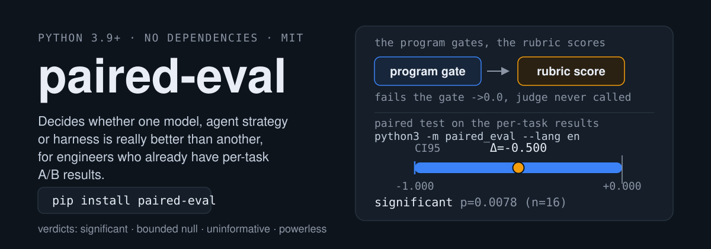

<h1 align="center">paired-eval</h1>

**paired-eval** is a zero-dependency Python library that decides whether one model, agent strategy or harness is really better than another, for engineers who already have per-task A/B results.

<p align="center">
  <a href="https://alloevil.github.io/paired-eval/"></a>
</p>
<p align="center"><em>Evaluate models, agents and harnesses: program checks first, rubrics for the rest, honest paired statistics.</em></p>
<p align="center">
  <a href="https://pypi.org/project/paired-eval/"></a>
  <a href="https://github.com/alloevil/paired-eval/actions/workflows/ci.yml"></a>
  <a href="pyproject.toml"></a>
  <a href="pyproject.toml"></a>
  <a href="LICENSE"></a>
</p>
<p align="center"><a href="https://alloevil.github.io/paired-eval/">Website</a> · <a href="README.zh-CN.md">中文</a> · <a href="docs/README.md">Docs</a> · <a href="CHANGELOG.md">Changelog</a></p>

**You ran model A and model B on the same 40 tasks. A scored 0.72, B scored 0.65. Is A better?**
Usually you cannot tell from those two numbers — and an LLM judge's "A is better" is not evidence either.
paired-eval answers with a paired test on the per-task results, a confidence interval, and a verdict that
says *significant* / *bounded null* (with the effect it rules out) / *uninformative* / *powerless* — never a bare "p > 0.05".

```sh
pip install paired-eval
```

> **Same name, different project.** This is the `paired-eval` published on [PyPI](https://pypi.org/project/paired-eval/) and developed in this repository — `pip install paired-eval`, then `import paired_eval`. An unrelated project shares the name: [labsyspharm/paired-eval](https://github.com/labsyspharm/paired-eval), which by its own README is "an O(n log n) implementation of paired evaluation" of machine-learning predictions against true labels, installed from GitHub and imported as `pairedeval`. Neither is a fork or a version of the other.

```python
import paired_eval as pe

a = [1, 0, 1, 1, 0, 1, 1, 0]          # per-task pass/fail (or scores) for system A
b = [1, 0, 0, 1, 0, 0, 1, 0]          # same tasks, same order, for system B
print(pe.interpret(pe.paired_compare(a, b))["text"])
```

Pure standard-library Python ≥ 3.9, no dependencies. You inject both the model (`call(prompt) -> str`) and the judge (`judge(prompt, system, schema) -> dict`); no vendor binding.

Three things it does, and why each exists:

| | Because |
|---|---|
| **Paired statistics** — per-round McNemar + per-task permutation, Holm correction, bootstrap CI, sample-size planning | Unpaired means on 40 tasks hide a 0.3 effect behind noise; paired tests on the same tasks do not |
| **Program gate, then rubric** — an answer that fails a programmatic check scores 0 and the judge is never called | Judges get fooled on "does it work"; programs do not. Spend judge calls only on ranking answers that already work |
| **Saturation & ceiling diagnostics** — tasks both systems always pass carry no information; a system at 1.0 has no headroom | Most "no difference" results are really "no informative tasks", and the remedy is different |

## What it is

paired-eval is a method and a small toolkit for comparing two evaluated systems honestly. It stacks verification — a program checks whatever has a unique ground truth, claims that must stay faithful to sources are grounded one by one against what the system actually saw, and only quality judgements reach a rubric — and then turns the resulting per-task scores into a paired statistical verdict. It is not a task library, an evaluation platform, a model client or a rubric generator: you inject the model call and the judge, and the 31 built-in tasks are examples and self-tests.

## Install

```sh
pip install paired-eval
```

Python 3.9 or newer, no third-party packages — `pyproject.toml` declares `dependencies = []` as a design constraint. Model and judge access is yours to inject as `call(prompt) -> str` and `judge(prompt, system, schema) -> dict`; a standard-library-only OpenAI-compatible adapter for both is in [examples/adapter_openai_compat.py](examples/adapter_openai_compat.py). To see the statistics layer without any API access, run `python3 -m paired_eval --lang en`.

## What it evaluates

The three objects ask three different questions and hold different things constant; mixing them up yields nothing.

| Evaluate | Hold constant | Vary | What one A/B looks like |
|---|---|---|---|
**model** | same tasks, same scaffold | the model | `{"A": call_a, "B": call_b}` |
**harness** | same model | prompt / scaffold / tool wiring | `{"strict": strict prefix, "bare": bare prompt}` |
**agent** | same model, same scaffold | the strategy | `{"single": one pass, "self-check": draft then self-correct}` |
**their interaction** | 2×2 factorial | both factors | main effects on one scale, ceilings flagged automatically |

## How it verifies: programmatic checks first, judges only for what they cannot cover

```
a unique ground truth ──→ exact (numeric / choice / set / \boxed{}) or a programmatic check(response) -> bool
only sources of fact  ──→ retrieval (verify against search) / trajectory (ground each claim in what the agent saw)
only a quality bar    ──→ rubric (per-criterion binary judging, weighted; the rubric must pass a canary: a bluffing answer must not score high)
```

Layers stack — **the program gates, the rubric scores**. Failing the gate scores 0 and never calls the judge: you do not pay a judge for an answer that is already wrong, and the judge cannot be fooled on "does it work" — it only ranks quality among candidates that do.

```python
import paired_eval as pe

task = {"id": "sum-explained", "instruction": "What is 12×12? Explain, and give the result starting with 'Answer: '",
        "verification": {"class": "gated",
                         "gate":  {"class": "exact", "gold": "144", "kind": "numeric", "marker": "Answer"},
                         "score": {"class": "rubric", "criteria": [{"text": "explains the calculation", "weight": 1}]}}}
r = pe.evaluate(task, response=answer, llm=judge)
print(r["score"], r["verdict"])        # wrong -> 0.0 'gated_out' (judge never called); right -> the rubric score
```

Other `evaluate` routes: `exact` (programmatic, no LLM), `retrieval`, `trajectory`, `rubric`; `rubric_canary` checks whether a rubric can be gamed by a bluffing answer.

## Ten seconds (an offline demo of the statistics layer)

```sh
python3 -m paired_eval --lang en        # or pe.set_language("en") once in code
```

**`strict` / `bare` here are two stub functions, not models** — they replay one real failure mechanism (under a bare prompt the correct JSON gets wrapped in markdown fences and fails to parse), only to show the shape of a report without any API. The output is real (a test keeps it identical to the current code):

```
informative sample: 2/4 tasks informative (always-pass 2, always-fail 0)
refusals: {'strict': 0, 'bare': 0}
at ceiling (1.000): strict — no headroom; effects measured against it as the reference are compressed
bare vs strict: Δ=-0.500 CI95=[-1.000,+0.000] | per-task p=0.506 per-round McNemar=0.00781 Holm=0.00781 | discordant 0:8 concentration=0.50 | significant: Δ=-0.500 CI95=[-1.000,+0.000] p=0.0078 (n=16)
```

Two tasks were solved by both systems every time and carry no information (informative sample 2/4); all 8 discordant pairs favour `strict`, spread over 2 tasks (concentration 0.50); the per-task permutation p is 0.506 because with 2 informative tasks **its minimum attainable p is 0.5**, while per-round McNemar uses all 16 paired units. The last clause is a verdict you can paste into a report.

## With real models: one A/B per object

**1. Mix verification classes by what can be verified.** Ground truth → programmatic; ground truth plus a quality bar → `gated`; only sources → `trajectory`:

```python
my_tasks = [
    {"id": "date", "instruction": "Write 5 March 2024 as an ISO 8601 date, starting with 'Answer: '",
     "verification": {"class": "exact", "gold": "2024-03-05", "marker": "Answer"}},
    {"id": "sum-explained", "instruction": "What is 12×12? Explain, and give the result starting with 'Answer: '",
     "verification": {"class": "gated",
                      "gate":  {"class": "exact", "gold": "144", "kind": "numeric", "marker": "Answer"},
                      "score": {"class": "rubric", "criteria": [{"text": "explains the calculation", "weight": 1}]}}},
    {"id": "summary", "instruction": "Write a one-sentence summary using only the source. Source: X's 2023 revenue was 41.2bn.",
     "observations": [{"tool_call_id": "t1", "tool": "doc", "observation": "X's 2023 revenue was 41.2bn."}],
     "verification": {"class": "trajectory", "grounding_policy": "must_ground"}},
]
```

**2. Plug in models and a judge, and turn the task set into what the paired pipeline eats.** The adapter is [examples/adapter_openai_compat.py](examples/adapter_openai_compat.py) (standard library only, any compatible endpoint); `bench_tasks` binarises each task's `evaluate` score at an explicit threshold — "pass" means ≥ this much, and that belongs in the report.

```python
from examples.adapter_openai_compat import make_call, make_llm   # standard-library-only OpenAI-compatible adapter

call_a, call_b = make_call(model="model-a"), make_call(model="model-b")
judge = make_llm(model="judge-model")
tasks = pe.bench_tasks(my_tasks, threshold=1.0, llm=judge)
```

**3. Three objects, each holding its own variable constant.** `n` is repeats per task per system; interleaving rotates the order.

```python
STRICT = "Follow the format exactly, no extra text. Task: "

def self_check(call):                     # agent strategy: draft, then self-correct against the instruction (one extra call, no tools)
    return lambda p: call(f"Instruction: {p}\nDraft: {call(p)}\nCheck the draft against the instruction; output only the corrected answer.")

runs = {
    "model":   pe.run_interleaved({"A": pe.make_model(call_a), "B": pe.make_model(call_b)},
                                  tasks=tasks, n=6, prompt_prefix=STRICT),
    "harness": pe.run_interleaved({"strict": pe.make_model(lambda p: call_a(STRICT + p)),
                                   "bare": pe.make_model(call_a)}, tasks=tasks, n=6, prompt_prefix=""),
    "agent":   pe.run_interleaved({"single": pe.make_model(call_a),
                                   "self-check": pe.make_model(self_check(call_a))}, tasks=tasks, n=6, prompt_prefix=""),
}
for axis, run in runs.items():
    print(axis, pe.report(run["reports"], refusals=run["refusals"], lang="en")["text"], sep="\n")
```

Plan the sample size before running, and let `interpret` state the conclusion afterwards:

```python
pe.required_tasks(0.30, 0.10)         # A wins 30% / loses 10% of tasks: paired tasks needed for 80% power
pe.required_pairs(0.15, 0.30)         # continuous scores, mean diff 0.15, sd 0.30 -> runs the real permutation test (~20 s)
pe.detectable_effect(31)              # the inverse: the smallest one-sided win rate 31 tasks can detect
pe.interpret(pe.paired_compare(scores_a, scores_b), lang="en")["text"]   # afterwards: what this result can and cannot say
```

`screen_tasks` / `screen_graded` screen for tasks that discriminate, in two stages; near-ceiling tasks (> 0.9) are excluded by default — they cannot be screened reliably at any affordable number of runs.

## Evaluating a real agent run

The `agent` axis needs the agent's actual tool observations, not a stub. [AgentXRay](https://github.com/alloevil/AgentXRay)
already normalises Claude Code / Codex / OpenClaw / Hermes / OMP / Gemini CLI logs into one shape; `paired_eval.adapters.agentxray`
turns that export into a `trajectory` task, so every claim in the agent's final answer is checked against what the agent actually saw:

```python
import json
from paired_eval.adapters import agentxray as ax

sess = json.load(open("tests/fixtures/agentxray-codex-session.json"))   # = curl http://localhost:3800/api/codex/sessions/<id>
task = ax.trajectory_task(sess)              # id, instruction, observations[], verification: trajectory
r = pe.evaluate(task, response=ax.final_answer(sess), observations=task["observations"], llm=judge)
print(r["score"])                            # grounding rate of the final answer
```

Two runs of the same instruction under two agents (or two harnesses) become one paired unit: score each, then `pe.paired_compare`.

## Reading the report

Every field in the report guards against one misreading — informative sample, ceiling/floor, discordant
concentration, and the four verdicts (*significant* / *bounded null* / *uninformative* / *powerless*).
`"p > 0.05"` means three different things with three different remedies: see
[docs/reading-the-report.md](docs/reading-the-report.md).

Where this sits next to lm-evaluation-harness, Inspect, promptfoo and openai/evals — they run the
evaluations, this one takes their per-task scores and says whether the difference is real:
[docs/related-work.md](docs/related-work.md).

## API overview

`import paired_eval as pe`:

| Group | Entry points |
|---|---|
Verifiers | `evaluate` (`exact` / `retrieval` / `trajectory` / `rubric` / `gated`) `evaluate_pair` `evaluate_batch` `validate_task` `grade_answer` `extract_claims` `verify_trajectory` `run_rubric` `rubric_canary` |
Paired A/B | `make_model` `bench_tasks` `judge_check` `run_interleaved` `run_paired` `run_repeated` `report` `pairwise_compare` `reliability_matrix` `saturation` |
Statistics | `paired_compare` `mcnemar_exact` `holm_adjust` `wilson_ci` `pass_hat_k` `required_tasks` `required_pairs` `detectable_effect` `p_floor` `min_units_for_alpha` `interpret` |
Screening | `screen_tasks` `screen_graded` · built-in `ALL_TASKS` (31 Chinese smoke tasks, for examples and self-tests) |
Adapters | `make_resilient` `throttled_pmap` `Meter` `set_language` · `paired_eval.adapters.agentxray` — AgentXRay session export → `trajectory` task (see below) |

## Scope and status

- **Is**: a method and toolkit for evaluating models / agents / harnesses — stackable verifiers (program gate + rubric score), honest statistics for paired comparison, sample-size planning, task screening.
- **Is not**: a large task library (the 31 built-in tasks are examples and self-tests), an evaluation platform, a model client, or a rubric **generator** (the autorubric half is not here — this evaluates whether a rubric can be fooled). Run large suites with the frameworks above and hand their per-task scores to this.
- **Status**: 0.4.0, single author, API may change. Reports in English and Chinese (`set_language`); code comments and built-in tasks are Chinese.
- [docs/findings.md](docs/findings.md) is a case study done with this toolbox on one model pair and three task families: harness and agent effects of about +0.6–0.75, model effect < 10%, the two with diminishing but stackable returns. The numbers are instance-specific and show how a conclusion should be written.

## When to use it

- You have per-task results for two systems on the **same tasks in the same order**, and you need to state publicly whether the difference is real.
- You are comparing a model against a model, a scaffold against a scaffold, or an agent strategy against an agent strategy, and want the three kept apart with the right variable held constant.
- Your comparison came back negative and you have to report **which effect size you ruled out**, not "no difference".
- You suspect the task set is saturated (both systems always pass), or a system sits at 1.0 so interaction terms stop meaning anything.
- You want to size the run before spending model calls (`required_tasks` / `required_pairs`) or to know what your existing task set can even see (`detectable_effect`).

## When NOT to use it

- **Not a benchmark suite.** The 31 built-in tasks are Chinese smoke tasks; `detectable_effect(31)` is 0.25, so they cannot support a confident verdict. Bring your own tasks, or run a real suite with the frameworks below and hand the per-task scores here.
- **Not for unpaired results.** The same tasks in the same order for both systems is a hard requirement; aggregate scores cannot be re-paired after the fact.
- **Not a runner or a platform.** No model client, no task execution, no dashboard — and no rubric *generator*; `rubric_canary` only tests whether a rubric can be fooled.
- **Not a source of general claims.** An effect measured on one task family does not transfer: tasks screened here for scaffold sensitivity turned out insensitive to the model.
- **Not stable yet.** 0.4.0, single author, API may change; code comments and built-in tasks are in Chinese, though reports are bilingual.

## Compared to lm-evaluation-harness, Inspect, promptfoo and openai/evals

Descriptions are taken from each project's own README; the full table lives in [docs/related-work.md](docs/related-work.md).

| Tool | What it does | Relation to paired-eval |
|---|---|---|
[lm-evaluation-harness](https://github.com/EleutherAI/lm-evaluation-harness) | 60+ academic benchmarks over many model backends; per-metric standard errors | Runs the evaluations; feed its per-task scores to `paired_compare` / `interpret` |
[Inspect](https://github.com/UKGovernmentBEIS/inspect_ai) | Eval framework: prompt engineering, tool use, multi-turn dialog, model-graded components; 200+ pre-built evals | Same; scorer output is per-sample and pairs naturally |
[promptfoo](https://github.com/promptfoo/promptfoo) | Side-by-side model/prompt comparison with assertions; red teaming | Overlaps on "compare"; paired-eval adds stacked verifiers and the statistical verdict layer |
[openai/evals](https://github.com/openai/evals) | Registry of template-based evals fed by JSON data | Same downstream relation |

## FAQ

**How do I install it and what does it need?** Run `pip install paired-eval`. It requires Python 3.9 or newer and installs no third-party packages, because `pyproject.toml` declares an empty dependency list as a deliberate design constraint. You supply model and judge access yourself as two callables, `call(prompt) -> str` and `judge(prompt, system, schema) -> dict`; a standard-library-only OpenAI-compatible adapter for both ships in [examples/adapter_openai_compat.py](examples/adapter_openai_compat.py). Nothing else needs configuring, and `python3 -m paired_eval --lang en` runs an offline demo with no API access at all.

**A scored 0.72 and B scored 0.65 on 40 tasks — is A better?** Usually you cannot tell from those two averages, which is the question this library exists to answer. Pass the per-task results of both systems, in the same task order, to `pe.paired_compare(a, b)` and hand the result to `pe.interpret`. You get an effect size with a bootstrap 95% interval, a per-round McNemar exact p-value, a per-task permutation p-value, Holm correction across several systems, the direction and concentration of the disagreements, and a verdict sentence you can paste into a report. If the two systems did not run the same tasks in the same order, no test can recover the pairing and the comparison has to be rerun.

**What is the difference between evaluating a model, a harness and an agent?** They are three questions that hold different things constant, and mixing them yields nothing. Evaluating the *model* fixes the tasks and the scaffold and varies the model; evaluating the *harness* fixes the model and varies the prompt, scaffold or tool wiring; evaluating the *agent* fixes model and scaffold and varies the strategy, for example a single pass against draft-then-self-correct. A 2×2 factorial puts two factors on one scale and flags cells at a ceiling or floor automatically, because an interaction computed against a cell stuck at 1.0 is an artifact of the design rather than a finding.

**Why won't it report "no significant difference"?** Because that phrase hides three situations with three different remedies. Too few paired units is *uninformative*: the design could never have seen a realistic effect, and the fix is more units. Too few discordant pairs is *powerless*: the exact test's attainable minimum p-value is set by the number of disagreements, so no effect size could reach significance, and the fix is more rounds or tasks that actually separate the systems. Enough units with a genuinely small effect is a *bounded null*, which must be reported together with the effect it excludes, for example "the model effect is below 10%". This project made that mistake itself, recorded it in [docs/corrections.md](docs/corrections.md), and then fixed it in `interpret` so it cannot recur silently.

**Can I trust the numbers in the findings?** Treat them as instance-specific usage examples, not inheritable results: they come from one pair of hosted models and a few task families, and the right move for your own systems is to rerun the tool rather than quote these values. Within that scope they are auditable three ways: the strongest findings are executable assertions in [`paired_eval/reproduce_findings.py`](paired_eval/reproduce_findings.py) so drift is detected instead of inherited, every retracted or revised conclusion is kept in [docs/corrections.md](docs/corrections.md) with its original wording and the evidence that overturned it, and each published number is listed with its metric, method, reproduction command and evidence link in [docs/claims.json](docs/claims.json).

## Docs · Contributing · License

[Docs index](docs/README.md) · [Methodology lessons](docs/lessons.md) (what each primitive guards against) · [中文 README](README.zh-CN.md) · [CONTRIBUTING.md](CONTRIBUTING.md) · MIT
