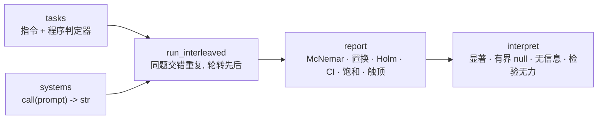

# paired-eval

比较两个 LLM 系统——不同的模型、提示、脚手架或 agent 策略——**哪个更好，结论有多可靠，样本够不够。**

[English](README.en.md) · [文档](docs/README.md) · [更新日志](CHANGELOG.md)

[](https://github.com/alloevil/paired-eval/actions/workflows/ci.yml)
[](pyproject.toml)
[](pyproject.toml)
[](LICENSE)

纯标准库 Python ≥ 3.9，零依赖。模型调用由你注入（任何 `call(prompt) -> str`），不绑定供应商。

## 安装

```sh
pip install git+https://github.com/alloevil/paired-eval.git
```

## 十秒钟看效果

```sh
python3 paired_eval.py            # --lang en 输出英文报告
```

两个桩系统在 4 道内置格式题上做配对 A/B（`bare` 在 JSON 题上把正确答案包进 markdown 围栏）：

```
有效样本: 2/4 题有信息(恒过 2, 恒败 0)
拒答: {'strict': 0, 'bare': 0}
触顶(1.000): strict —— 该系统无余量, 它作为参照时效应会被压缩
bare vs strict: Δ=-0.500 CI95=[-1.000,+0.000] | 逐题p=0.506 逐轮McNemar=0.00781 Holm=0.00781 | 不一致对 0:8 集中度=0.50 | 显著: Δ=-0.500 CI95=[-1.000,+0.000] p=0.0078 (n=16)
```

两题两系统全对、不携带信息（有效样本 2/4）；8 个不一致对全部偏向 `strict`，分布在 2 题上（集中度 0.50，非单题异常）；
逐题置换 p=0.506 是因为只有 2 道有信息题，**它的最小可能 p 就是 0.5**，而逐轮 McNemar 用上全部 16 个配对单元。末段是可直接写进报告的结论。

## 特性

- **同题交错重复、逐题配对**——不是两个独立均值的差；报效应量与 bootstrap 区间
- **配对精确检验**：McNemar（二值）、符号翻转置换（连续分），多系统两两比较做 Holm 校正；不假设正态
- **四种结论而非一个 p 值**：显著 / 有界的 null（能排除多大效应）/ 无信息 / 检验无力（缺的是不一致对还是单元，处方不同）
- **有效样本与触顶诊断**：告诉你哪些题没在贡献信息、哪个系统满分导致效应被压缩
- **事前样本量规划**：`required_tasks` / `required_pairs` 内部真跑将要使用的检验，不用闭式近似
- **可组合的验证器**：精确匹配 → 程序判定 → 检索核实 → agent 轨迹忠实性 → rubric（自带 canary，防被糊弄回答骗过）
- **报告中英双语**（`set_language("en")`）；README 里每段示例代码与贴出的输出都由测试真跑核对



## 用你自己的系统和任务

**1. 定义任务**——指令、程序判定器、一个合法输出样例（自检用）。判定器故意严格：测的就是指令遵循。

```python
import paired_eval as pe

tasks = [
    {"id": "date-iso", "instruction": "把 2024年3月5日 写成 ISO 8601 日期, 只输出日期",
     "check": lambda r: r.strip() == "2024-03-05", "canonical": "2024-03-05"},
    {"id": "json-pair", "instruction": '输出 JSON 对象 {"a": 1}, 不要其他内容',
     "check": lambda r: r.strip() == '{"a": 1}', "canonical": '{"a": 1}'},
]
```

**2. 接上模型**——任何 `call(prompt) -> str`。`make_model` 负责有界重试，持续失败转为"拒答"成对丢弃，不崩整批。
[`examples/adapter_openai_compat.py`](examples/adapter_openai_compat.py) 是一个只用标准库的 OpenAI 兼容适配器。

```python
systems = {"strict": pe.make_model(call_strict), "bare": pe.make_model(call_bare)}
```

**3. 跑，读报告**——`n` 是每题每系统的重复次数；交错运行轮转先后顺序，时间窗漂移进不了比较。

```python
run = pe.run_interleaved(systems, tasks=tasks, n=8, prompt_prefix="")
print(pe.report(run["reports"], refusals=run["refusals"])["text"])
```

## 还能做什么

**评 agent 的回答是否忠实于它看到的观察**（逐条抽 claim 对轨迹 grounding：grounded / distorted / fabricated）：

```python
r = pe.evaluate({"id": "q1", "instruction": "总结资料",
                 "verification": {"class": "trajectory", "grounding_policy": "must_ground"}},
                response=answer, observations=observations, llm=judge)
print(r["score"], r["metrics"]["fabricated"])      # grounding_rate, 无据 claim 数
```

`judge(prompt, system, schema) -> dict` 是带 JSON-schema 约束的结构化调用。`evaluate` 还路由 `exact`（纯程序）、`retrieval`（检索核实）、`rubric`（逐条判定 + 加权）。

**跑之前算样本量**：

```python
pe.required_tasks(0.30, 0.10)         # A 胜率 30%、负率 10%: 要多少配对任务才有 80% 功效
pe.required_pairs(0.15, 0.30)         # 连续分数: 均值差 0.15、sd 0.30 -> 内部真跑置换检验求 n(约 20 秒)
pe.detectable_effect(31)              # 反过来: 31 道题最小能检出多大的单方面胜率
pe.interpret(pe.paired_compare(scores_a, scores_b))["text"]   # 事后: 这个结果能说什么
```

**筛出有区分力的题**：`screen_tasks` / `screen_graded` 两阶段筛选，默认排除成功率 > 0.9 的近顶题——它们在任何可负担轮数下都筛不稳。

## 报告怎么读

| 字段 | 含义 |
|---|---|
有效样本 | 两系统全轮次同结果的题不贡献信息；MDE 按有信息题数读 |
拒答 | 各系统被丢弃的调用数——拒答率是结果的一部分 |
触顶 / 触底 | 满分或零分的系统无余量；与它比较效应被压缩，交互项不可解释 |
Δ, CI95 | 效应量与 bootstrap 95% 区间 |
逐题 p / 逐轮 McNemar / Holm | 两种配对检验；多系统时的多重校正 |
不一致对 a:b, 集中度 | 分歧的方向与分布；1.0 = 全部来自一道题 |
结论句 | 显著 · 有界 null（附能排除多大效应）· 无信息 · 检验无力（附缺多少什么） |

## 与其他工具的关系

它们是*运行*评测的框架；本项目接在下游，不重复任务库与模型后端。描述取自各项目自己的 README。

| 工具 | 它做什么 | 关系 |
|---|---|---|
[lm-evaluation-harness](https://github.com/EleutherAI/lm-evaluation-harness) | 60+ 学术基准、多种模型后端；按指标报标准误 | 它产出逐题分数 → 交给 `paired_compare` / `interpret` |
[Inspect](https://github.com/UKGovernmentBEIS/inspect_ai) | 评测框架：提示工程、工具使用、多轮对话、模型评分；200+ 预置评测 | 同上；scorer 输出逐样本，天然可配对 |
[promptfoo](https://github.com/promptfoo/promptfoo) | 模型/提示 side-by-side 对比与断言；red teaming | 在"比较"上重叠；本项目补统计结论层 |
[openai/evals](https://github.com/openai/evals) | 模板 + JSON 数据的评测注册表 | 同样的下游关系 |

## API 一览

`import paired_eval as pe`：

| 分组 | 入口 |
|---|---|
配对 A/B | `make_model` `run_interleaved` `run_paired` `run_repeated` `report` `pairwise_compare` `reliability_matrix` `saturation` |
任务与评分 | `evaluate` `evaluate_pair` `evaluate_batch` `validate_task` · 内置 `ALL_TASKS`（31 道中文冒烟题，示例与自测用） |
判定器 | `grade_answer` `extract_claims` `verify_trajectory` `run_rubric` `rubric_canary` |
统计 | `paired_compare` `mcnemar_exact` `holm_adjust` `wilson_ci` `pass_hat_k` `required_tasks` `required_pairs` `detectable_effect` `p_floor` `min_units_for_alpha` `interpret` |
筛题 | `screen_tasks` `screen_graded` |
适配 | `make_resilient` `throttled_pmap` `Meter` `set_language` |

## 范围与状态

- **是**：比较两个（或多个）系统的统计工具 + 可组合的验证器栈。
- **不是**：大规模题库（内置 31 题只作示例与自测）、评测平台、模型客户端。跑大规模任务集请用上面那些框架，把逐题分数交给这里。
- **状态**：0.2.0，单作者，接口可能变。报告中英双语；代码注释与内置题为中文。
- [docs/findings.md](docs/findings.md) 是用本工具做的一次案例研究，数字是实例特定的，展示的是报告该怎么写。

## 文档 · 贡献 · 许可

[文档索引](docs/README.md) · [方法学教训](docs/lessons.md)（每个统计原语防的是什么错）· [CONTRIBUTING.md](CONTRIBUTING.md) · MIT
